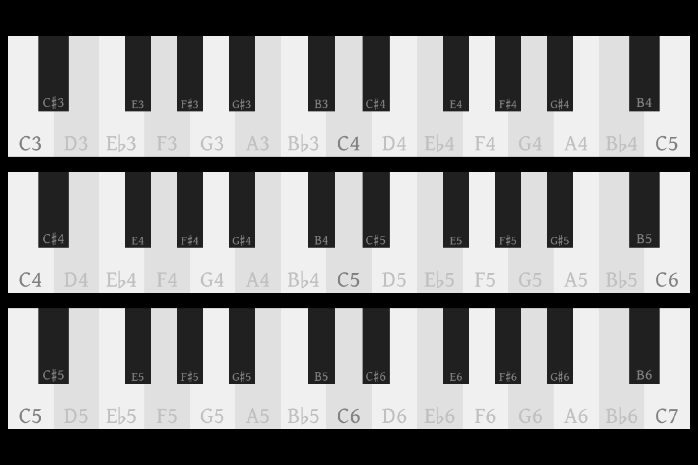
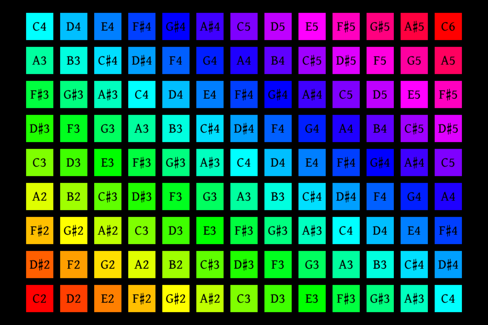

# What is MollyTime?

MollyTime is a system for creating simple ad hoc low latency touch screen GUIs for sending
MIDI events to arbitrary MIDI devices.

MollyTime implements two virtual MIDI controllers that are intended to be operated
via a touch screen interface or a mouse.

MollyTime is also intended to be useful for building stuff like simple MIDI sequencers and
editors, but it currently *lacks* functionality that woud be useful for that (like editing
tracker files or MIDI files).

Here are some examples of virtual MIDI controllers made with MollyTime:

# Who is MollyTime For?

A basic working knowledge of Python and a bit of courage is required to use MollyTime,
as you will need to edit a source file to change what MIDI devices it looks for.

MollyTime does not require a portable touch screen monitor, but having one is recommended.

# Getting Started

Currently MollyTime requires ALSA for working with MIDI devices.  Other platform
backends may be added as needed in the future, but today this means MollyTime only
supports Linux.

## Required Dependencies (All)

### pygame

MollyTime uses [pygame](https://www.pygame.org/) to draw the UI and manage input events.
You can install pygame like so:

 `pip install pygame`

## Required Dependencies (Linux Specific)

### alsa-midi

MollyTime uses [alsa-midi](https://python-alsa-midi.readthedocs.io/en/latest/).
You can install alsa-midi like so:

 `pip install alsa-midi`
 
## Installation (All)

MollyTime is not currently available as a pip package.  In fact, there is no way to install
MollyTime right now!  Just download it somewhere on your computer and run the scripts directly.
 

# Running MollyTime

Unless you happen to have the same MIDI instruments as I do, you will first need to modify the
`device_priority` variable in 'midi.py' to tell the device selection code what you want it to match.

Plug a MIDI istrument into your computer and run either `piano.py` or `pads.py` to jam on a virtual
MIDI controller.

Also note that MollyTime always selects the last display on the assumption that it is a portable
USB touch screen that you plugged in some time after logging into your computer but before running
MollyTime.  Mouse input is also supported making this appropriate for a single screen session. 
This selection behavior is currently implemented redundantly in both `piano.py' and 'pads.py'.

# System Latency

There are a lot of things that can cause latency, and most of these are things are not things
MollyTime can control.  Here are some things that can introduce latency, which if not managed
carefully can prevent virtual MIDI controllers from being useful for real time performances:

 - Your operating system.  The stock Linux kernel shipped in the Fedora distrobution seems fine.
 
 - Virtual synthesizers.  TiMidity++ is known to introduce significant latency.
   
 - Your hardware.  The touch screen I have happens to be fine, but I can't make this guarantee
   for all hardware.
   
If you are having latency problems, try to isolate the problem by swapping out stuff.

# Development Notes

## Jargon

 - **Hot Path**:  Any block of code or functions that must prioritize fast execution.  These are
   functions that run frequently.  Execution of hot paths effectively blocks processing input, 
   drawing the GUI, and (most importantly) sending MIDI events.  Hot paths should always
   prioritize fast execution.
   
 - **Cold Path**:  Any block of code or functions that are only executed before or after the main
   loop starts.  These paths effectively only delay the application startup.  Cold paths should
   emphasize clarity over efficiency.
   
 - **Tile**:  A tile is a subclass of the `Tile` class (or an instance of said subclass), and is
   the basic unit of *interactivity* in MollyTime.  These are responsible for managing the
   information needed to draw itself, and implementing event handlers.  Tiles currently can be
   idle or held, but they don't need to do anything if you don't want them to.  Tiles create and
   manage their own `pygame.Surface` instances and corresponding placement `pygame.Rect` objects.
   
 - **Plate**:  A plate is a subclass of the `Plato` class (or an instance of said subclass), which
   represents a big hefty slab.  The job of a plate is to figure out which tiles need to construct
   and where to place them.  Tiles do not determine their own placement.  Plates use a coordinate
   system called "Pips" to determine their relative placement and sizes.  Plates usually don't
   define any interactive behavior (that is what tiles are for), but events are routed through 
   plates to their tiles via machinery defined on the `Plato` class.
   
 - **The Play Space**:  The play space refers to an instance of the `PlaySurface` class, which is
   responsible for determining conversion from pips to screen space coordinates, starting finalizing
   the construction of plates (and tiles, indirectly).  At run time the play surface routes mouse
   and touch events to the plates.  Typically you construct the `PlaySurface` indirectly by using
   an instance of the `Instrument` class instead.  It is only useful to have one play surface
   per session, but this may change if modal interfaces are implemented.
   
 - **Pips**:  Pips are the basic layout unit of MollyTime.  Plates are defined in terms of rectangular
   spans of pips in an unbounded space abstract space.  In the interest of simple conversion to Pygame's
   screen coordinate system, the positive quadrant of pip space is also the bottom right quadrant.
   The conversion from pip space to screen space is defined by the play surface when it is constructed
   from the plats it was provided.  Plates are always entirely visible, so the conversion from pip space
   to screen space always is whatever fills the screen with plates as best as possible.
   Pips are always coerced to integer coordinates to ensure that same sized plates always have
   a uniform pixel size on screen regardless of placement.  However, tiles can cheat and use
   fractional positions, as is demonstrated in `piano.py`.
   
 - **Instrument**:  The word "instrument" may refere to either a literal musical instrument, or
   it may refer specifically to the `Instrument` class, which confusingly you do *not* need to
   subclass to create a new instrument.  I will probably rename the `Instrument` class to avoid
   confusion.

## The Widget System

MollyTime is intended to be a relatively low latency application, and so MollyTime takes the
philosophy that the art of writing low latency applications in a slow language like Python is
the art of carefully managing your hot and cold paths.

MollyTime primarily uses two kinds of objects to create and manage widgets.

The first important object category is a *plate*, which is a subclass of the `Plato` class.  This is a
giant rectangular plate that functions as a backplane for interactive tiles.  Plates are responsible
for determining what tiles to create, where to create them.  At run time, plates passively route input
events to their tiles, and do little else.

The second important object category is a *tile*, which is a subclass of the `Tile` class.  Tiles
implement virtually all of the interactive behavior of your widget.  Tiles generally do *not* have
any inherent awareness of one another or the plate they are attached to, but that is not a strict
requirement.  Generally an instrument would deterine up front what MIDI note a tile corresponds to,
and the tile would send the events to the midi subsystem directly via the tile's event handler callbacks.

When these objects are constructed into a play space, the result is a shallow hierarchy that can be
traversed quickly for input event routing and drawing.  When the construction of these objects is
finalized, they are meant to wrap a fixed set of `pygame.Rect` and `pygame.Surface` objects that
are cached for rapid blitting onto the screen surface.

At construction time, plates use a coordinate system called "pips" to define relative placement.
Tiles are constructed with screen space `pygame.Rects` during the finalization process.  Tiles are
generally meant to treat their rects as opaque handles, and not be aware of their own absolute
coordinates, but it is not useful to enforce this via abstraction.

At run time, plates and tiles both only operate on their assigned `pygame.Rects` objects, which
effectively means they only operate in terms of screen space at run time.

## Surface Management

MollyTime uses `pygame.Surface` objects to draw everything.  These are created up front during the
construction process.  The file `surface_tools.py` provides an API for common construction tasks.
This includes a memoization system to prevent redundant construction on the theory that this will
help MollyTime boot faster.

You should avoid creating new surfaces at run time.

## Creating New MIDI Controller

The file `widgets.py` implements MollyTime's gui framework.  Typically you will subclass the `Tile`
and `Plato` classes to implement your MIDI controller.  The `Instrument` class provides a wrapper
for running your instrument, but is itself not typically subclassed.

The file `midi.py` provides a thin abstraction over the platform MIDI API.  This defines functions
for sending note events and program changes currently.  CC controls and other events will be
defined here in the future.  Typically you run your instrument by passing in an instance of the
`Instrument` class into the `run` method defined in `midi.py`.

The docstrings in these classes detail their usage.  Files `piano.py` and `pads.py` implement
provide working instruments that may be useful to reference.
