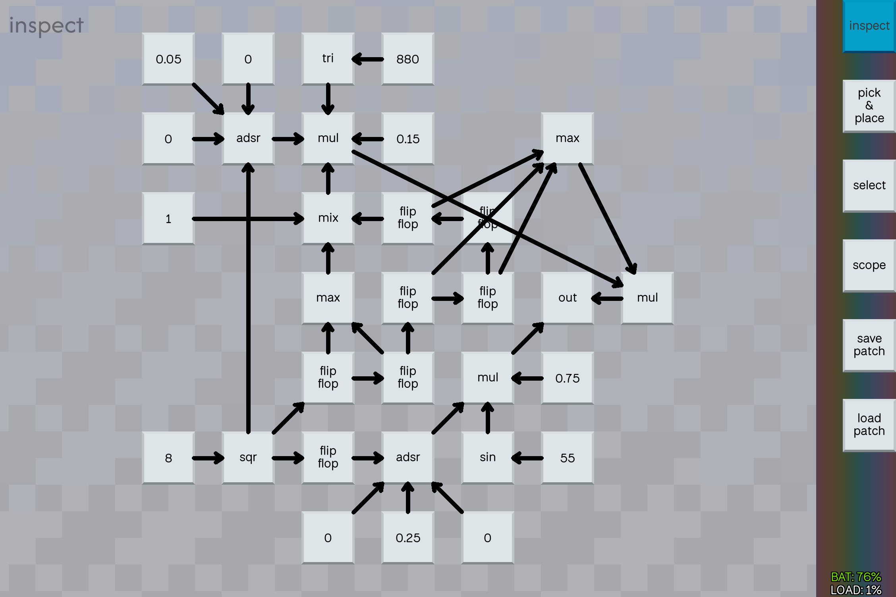

# What is Mollytime?

Mollytime is a virtual synthesizer, with a visual patch editor designed for
touch screen devices.  Mollytime is intended to be useful for live
performances, and dynamic sound tracks for interactive media such as video-games
and installation art.

# This Synthesizer Is Under Construction

While Mollytime is already quite usable, it is still missing quite a bit of
polish and several major features, and is not quite ready for prime time.

# I want to use it anyway!

Mollytime is a Python-based project, so you'll naturally need Python 3. Other Python
package dependencies will be automatically acquired by the build system.
These will go in your current environment, so setting up a `venv` is supported and
recommended.

You'll also need a C++ toolchain to build the core extension module. Supported
platforms, as in "we've tried these and it seems to work fine":
- Linux, via Clang or GCC, using glibc
- Windows, via Clang or MSVC, using MSVC 2022

Whatever you're using needs its binaries available on `PATH`.

Other dependencies you'll currently need to acquire yourself:
- JACK, if building with the JACK audio backend.
- Windows 11 SDK (10.0.22621.5040) or newer, if building with the WASAPI backend.
  (Don't worry, it also works with Windows 10.)

Once you have determined the correct versions of each of these dependencies,
please let me know and I'll write them down here.

## "I want to work on / quickly try out the project!"

As a one-time setup step, run this helper script to automatically download &
build third-party dependencies:
- `python mollybuild.py init <toolchain>`

Then, build the project to set up a development environment:
- `python mollybuild.py build <mode> <toolchain>`

That's it! Now just run `python -m mollytime` to launch the project. When you do,
the C++ extension module will be automatically recompiled if you've changed any
source files since the last run.

You can see supported `<mode>`s and `<toolchain>`s by checking command help:
- `python mollybuild.py init -h`
- `python mollybuild.py build -h`

If you omit the toolchain, it'll detect your system "default." This might work
even if your system default isn't on the supported list, but it might not.

## "I want to build a 'exe'!"

After `mollybuild.py build`, run this:
- `python mollybuild.py exe`

This uses [Pyinstaller](https://pyinstaller.org/) to bundle the project & its
dependencies into a single-file executable, output to a `dist` subfolder.

## "I want to package the project for distribution!"

Run this:
- `python mollybuild.py package <toolchain>`

This executes [`build`](https://build.pypa.io/en/latest/) on the project, with all
required settings pre-configured. An sdist and wheel will be output to a `dist`
subfolder.

You can see supported `<toolchain>`s by checking command help:
- `python mollybuild.py package -h`

If you omit the toolchain, it'll detect your system "default." This might work
even if your system default isn't on the supported list, but it might not.

## "I need to do things to the build system..."

With sincere condolences, consult `BUILD.md` for more details.